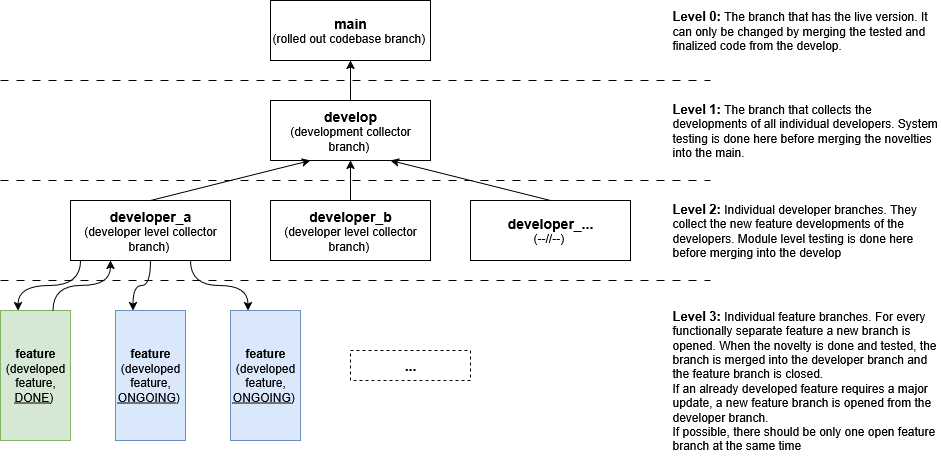

# ModularAI - Grocery Store AI System

A scalable, domain-adaptable AI framework for intelligent retail systems. This instance implements a full-stack grocery store solution with predictive analytics, RAG chatbots, and microservices architecture.

## Architecture

```
modularai/
├── core_services/           # Shared infrastructure
│   ├── database/           # DB connection & models
│   ├── auth/               # Authentication service
│   └── rag/                # RAG embedding & retrieval
├── domain_services/
│   └── grocery/            # Grocery business logic
│       ├── api/            # FastAPI routes
│       ├── models/         # SQLModel schemas
│       ├── ml_pipelines/   # Demand forecasting, inventory prediction
│       └── main.py         # Service entrypoint
├── webui/
│   ├── manager_dashboard/  # Vue 3 admin interface
│   └── ds_workbench/      # Streamlit ML interface
└── infra/
    └── docker-compose.yml  # Container setup
```

## Tech Stack

- **Backend**: FastAPI + SQLModel
- **Database**: Supabase (PostgreSQL + Auth + Realtime)
- **Frontend**: Vue 3 + Tailwind CSS
- **ML**: PyTorch, scikit-learn, sentence-transformers
- **RAG**: Local LLM + vector embeddings
- **Deploy**: Docker Compose

## Key Features

**For Store Managers:**
- Inventory dashboard with stock levels and forecasts
- Automated stockout alerts and demand predictions
- Role-based access per store location

**For Data Scientists:**  
- Plug-and-play ML pipelines for demand forecasting
- Real-time transaction data access
- Model experiment tracking

**For Customers:**
- RAG-powered product chatbot
- Semantic product search using embeddings

## Core Models & Data Flow

**Database Models (SQLModel):**
- `Product`: id, name, category, price, stock_level, embeddings
- `Transaction`: id, product_id, quantity, timestamp, store_id
- `Store`: id, name, location, manager_id
- `User`: id, email, role, store_id

**ML Pipelines:**
- Demand forecasting: Historical transactions → Future demand predictions
- Stockout prediction: Current inventory + demand → Alert triggers
- Product embeddings: Product descriptions → Vector representations

**RAG System:**
- Product catalog → Sentence transformer embeddings → Vector store
- User query → Embedding → Similarity search → LLM response

## Environment Setup

```bash
# Required environment variables
SUPABASE_URL=your_supabase_project_url
SUPABASE_ANON_KEY=your_anon_key
SUPABASE_SERVICE_KEY=your_service_key
DATABASE_URL=your_supabase_postgres_url

# ML Models
EMBEDDING_MODEL=all-MiniLM-L6-v2
LLM_MODEL=ollama/llama2

# API Config
API_HOST=0.0.0.0
API_PORT=8000
```

## Quick Start

### 🐳 Docker (Recommended)

```bash
# 1. Clone the repository
git clone <your-repo-url>
cd plutusai

# 2. Start all services with Docker Compose
cd infra
docker-compose up -d

# 3. Initialize database (one-time setup)
docker-compose exec grocery-api python -m core_services.database.init_db

# 4. Access applications
# FastAPI Backend: http://localhost:8000
# API Documentation: http://localhost:8000/docs
# Streamlit Demo: http://localhost:8501
# PostgreSQL: localhost:54322
```

### 🔧 Local Development (without Docker)

These instructions guide you through setting up and running the application locally using a Conda virtual environment.

**Prerequisites:**
- [Conda](https://docs.conda.io/projects/conda/en/latest/user-guide/install/index.html) installed on your system.

**1. Create and Activate the Conda Environment**

```bash
# Navigate to the build directory
cd build

# Create the Conda environment from the environment.yml file
conda env create -f environment.yml

# Activate the newly created environment
conda activate plutusai
```

**2. Configure Environment Variables**

```bash
# Navigate back to the root directory
cd ..

# Create a local .env file from the example
cp .env.example .env
```

After creating the `.env` file, you may need to update the `DATABASE_URL` to match your local PostgreSQL instance if you are not using the one from the Docker setup.

**3. Initialize the Database**

With the `plutusai` environment activated, run the database initialization script:

```bash
python -m core_services.database.init_db
```

**4. Run the Application**

Open two separate terminal windows, activate the `plutusai` environment in each, and run the following commands:

```bash
# Terminal 1: Start the FastAPI Backend
python -m domain_services.grocery.main
```

```bash
# Terminal 2: Start the Streamlit Frontend
streamlit run webui/ds_workbench/streamlit_app.py
```

**5. Access the Application**

- **FastAPI Backend**: [http://localhost:8000](http://localhost:8000)
- **API Docs**: [http://localhost:8000/docs](http://localhost:8000/docs)
- **Streamlit Frontend**: [http://localhost:8501](http://localhost:8501)

## API Endpoints

- `GET /products` - List products with stock levels
- `POST /products/{id}/forecast` - Get demand predictions
- `GET /inventory/alerts` - Current stockout warnings  
- `POST /chat` - RAG chatbot for product queries
- `POST /ml/retrain` - Trigger model retraining

## 🐳 Docker Deployment

### Production Deployment
```bash
# Build and start all services
docker-compose -f infra/docker-compose.yml up -d --build

# View logs
docker-compose -f infra/docker-compose.yml logs -f

# Stop services
docker-compose -f infra/docker-compose.yml down
```

### Service Architecture
- **grocery-api**: FastAPI backend (port 8000)
- **ds-workbench**: Streamlit frontend (port 8501)  
- **postgres**: PostgreSQL database (port 54322)
- **manager-dashboard**: Vue.js UI (port 3000) *[planned]*

### Environment Variables
Copy `.env.example` to `.env` and customize:
- Database credentials
- Supabase configuration
- ML model settings

## Development Roadmap

✅ **Completed:**
- Complete FastAPI backend with SQLModel ORM
- PostgreSQL database with sample data
- Comprehensive API endpoints (products, inventory, chat, ML)
- Streamlit demo frontend with interactive dashboard
- Docker containerization for all services
- Unit tests with 100% pass rate
- Git repository initialization

🚀 **Next Priorities:**
- Vue.js Manager Dashboard UI
- Advanced ML demand forecasting
- RAG chatbot with vector embeddings
- Real-time notifications
- Authentication & authorization
- Manager dashboard completion

## 📋 Repository Information

### Branching rules for development



### Git Repository Status
- **Repository**: Fully initialized with comprehensive commit history
- **Branches**: `main` (default)
- **Commits**: 3 major commits covering full development cycle
- **Files**: 39 tracked files with proper .gitignore configuration

### Repository Setup Commands
```bash
# Clone repository
git clone <your-repo-url>
cd plutusai

# View commit history
git log --oneline

# Check repository status
git status
```

### Contributing
1. Fork the repository
2. Create a feature branch (`git checkout -b feature/amazing-feature`)
3. Commit changes (`git commit -m 'Add amazing feature'`)
4. Push to branch (`git push origin feature/amazing-feature`)
5. Open a Pull Request

### Repository Structure
```
plutusai/
├── core_services/          # Core infrastructure services
├── domain_services/        # Business logic services
├── webui/                  # Frontend applications
├── infra/                  # Docker and deployment configs
├── tests/                  # Unit and integration tests
├── supabase/              # Database configuration
├── requirements.txt        # Python dependencies
├── docker-compose.yml     # Multi-service orchestration
└── README.md              # This file
```
